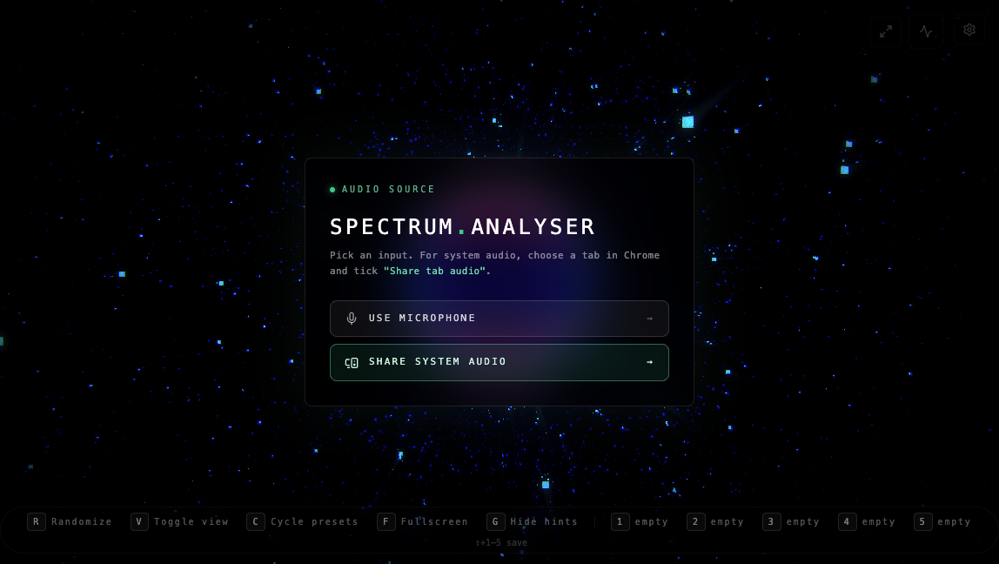
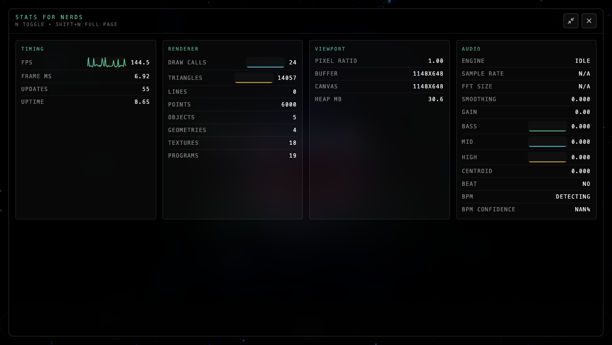
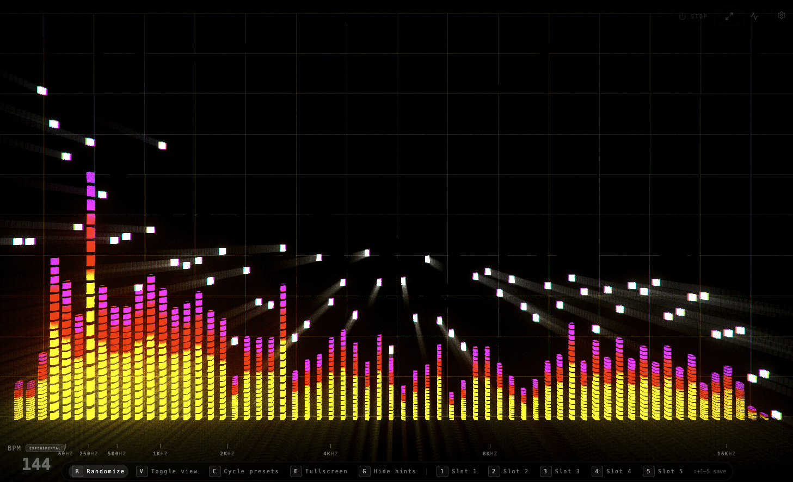
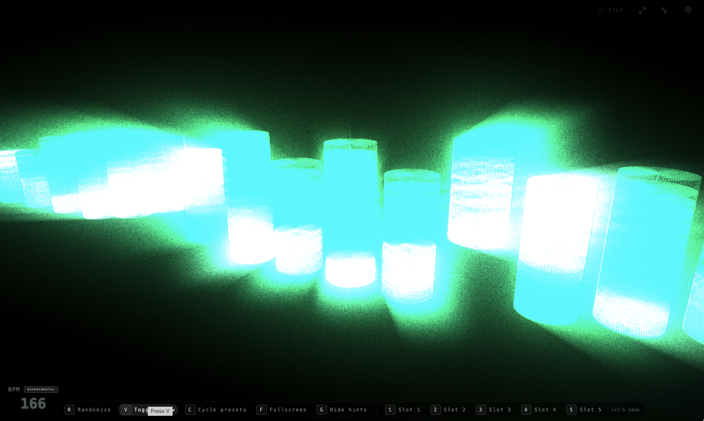

# Spectrum Aura

Spectrum Aura is a dynamic, real-time visual analyser that turns live sound into motion, light, depth, and rhythm directly in your browser.

No installs for viewers. No backend. No upload flow. Open the page, feed it audio, and the scene responds instantly.

Spectrum Aura is designed for use on desktop browsers, and can visualise audio from any Chromium based broswer or your devices microphone. It is not designed for mobile broswers but may work, but only using your phones microphone.

It is not designed to be used for any formal audio analysis, it's intended purely for fun and to create an exciting visual treat, working best with music, like Spotify or YouTube in your browser.

## Live Demo

- GitHub Pages: [https://danamini.github.io/spectrum-aura/](https://danamini.github.io/spectrum-aura/)

Depending on your hardware you may need to tune performance via the options in settings.

## A Quick Summary

- Browser-native real-time rendering with animated 3D scenes and post-processing.
- Designed for live sessions: quick mode switching, keyboard-first controls, and preset slots.
- Multiple visual personalities in one app: Combo, Classic, and Ripple.
- Beat-aware motion and camera behavior that reacts to energy, not just raw levels.
- Works with microphone input or shared tab/system audio.

## Screenshots

<table>
	<tr>
		<td></td>
		<td></td>
	</tr>
	<tr>
		<td></td>
		<td></td>
	</tr>
</table>

## Experience Highlights

### Input modes

- Use microphone for ambient or live room capture.
- Use tab/system audio for direct playback-reactive visuals.

For shared tab/system audio in Chrome:

- Select a browser tab when prompted.
- Enable **Share tab audio**.

### Visual engines

- Combo: radial bars, reactive sphere, particles, BPM-driven energy.
- Classic: horizontal LED/bar analyzer with peak hold behavior.
- Ripple: ring-wave field with configurable band columns.

### Live controls

- `R` randomize look
- `V` toggle visual mode
- `C` toggle preset cycling
- `F` toggle fullscreen
- `G` show/hide hint bar
- `1-5` load preset slot
- `Shift + 1-5` save slot
- `N` toggle stats panel
- `Shift + N` fullscreen stats panel

### Tunable signal + render pipeline

- FFT size, smoothing, gain, beat sensitivity
- Camera drift and beat response controls
- Post FX controls: bloom, chroma, grain, vignette, DOF, glitch, god rays, grading

## Presets

- Built-in presets for fast scene changes.
- First-time users are seeded with five curated starter slots by default.
- Five user slots saved in local storage.
- Slot cycle mode for automated live rotation.

## Tech Stack (Lower-Level Details)

- React 19 + TypeScript
- Three.js + custom shader materials
- Vite 7
- Static SPA output (no backend services)

## Local Development

### Prerequisites

- Node.js 20+
- npm 10+

### Install + run

```bash
npm install
npm run dev
```

Default local URL:

- http://localhost:6789

### Build + preview

```bash
npm run build
npm run preview
```

### Lint + format

```bash
npm run lint
npm run format
```

### Tests

```bash
npm run test
npm run test:run
```

### Pre-commit quality check

```bash
npm run check
```

## Project Layout

- `src/App.tsx`: single-page shell
- `src/main.tsx`: browser entry point
- `src/components/analyser`: UI and interaction layer
- `src/components/analyser/engine`: audio analysis, scene logic, shaders, post FX

## Deploy

Build static assets and publish `dist/` to any static host.

```bash
npm run build
```

## Signal Processing Deep Dive

Detailed notes on FFT, bass energy extraction, beat detection, and BPM estimation:

- [FFT and beat detection doc](docs/fft-and-beat-detection.md)
