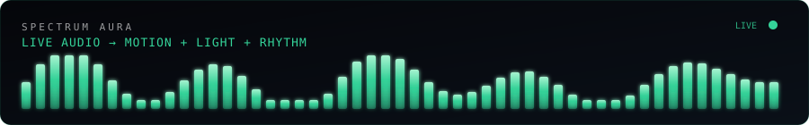
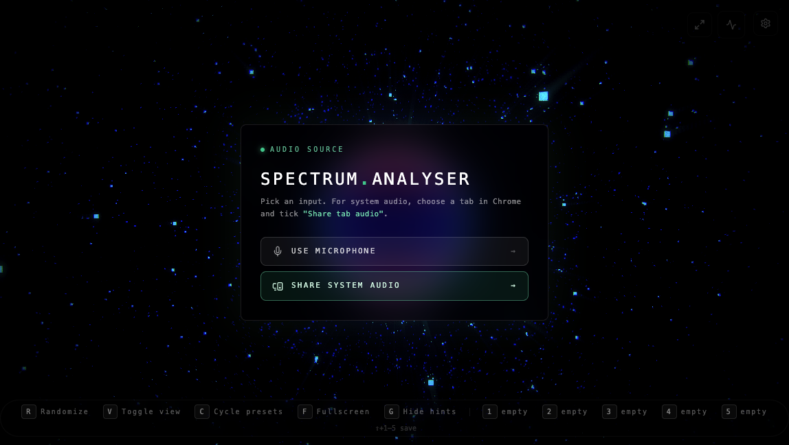
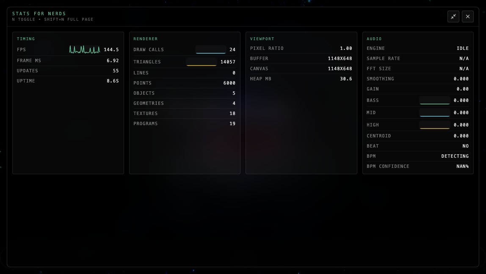
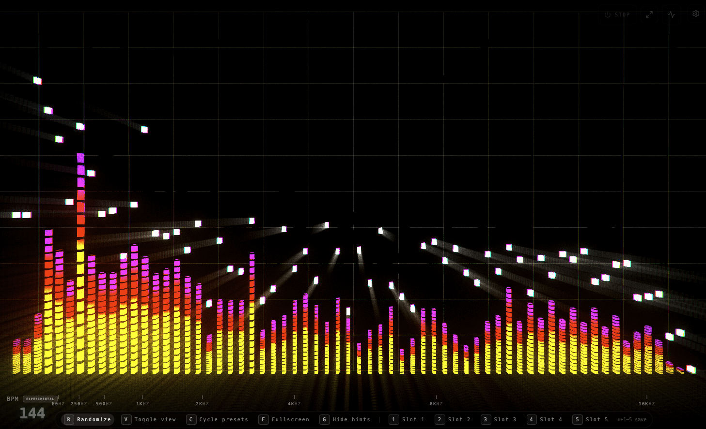
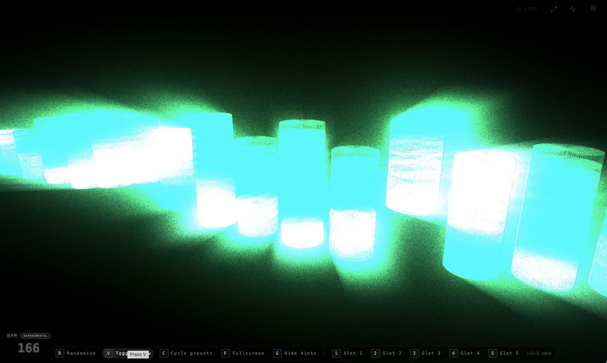

<div align="center">


[](https://danamini.github.io/spectrum-aura/)
[](https://github.com/danamini/spectrum-aura/releases)
[](https://github.com/danamini/spectrum-aura/actions/workflows/ci.yml)
[](https://github.com/danamini/spectrum-aura/actions/workflows/deploy.yml)
[](https://github.com/danamini/spectrum-aura/actions/workflows/ci.yml)
[](LICENSE)
[](docs/DEVELOPMENT.md)
[](https://threejs.org/)




**[Open live demo](https://danamini.github.io/spectrum-aura/)** · [Releases](https://github.com/danamini/spectrum-aura/releases) · [Changelog](CHANGELOG.md) · [Docs](docs/README.md)

<p><strong>Built with</strong></p>

<p>
  <a href="https://skillicons.dev"></a>
</p>

</div>

Spectrum Aura is a dynamic, real-time visual analyser that turns live sound into motion, light, depth, and rhythm directly in your browser.

No installs for viewers. No backend. No upload flow. Open the page, feed it audio, and the scene responds instantly.

Spectrum Aura is designed for use on desktop browsers, and can visualise audio from any Chromium based browser or your device microphone. It is not designed for mobile browsers but may work, but only using your phone microphone.

It is not designed to be used for any formal audio analysis, it's intended purely for fun and to create an exciting visual treat, working best with music, like Spotify or YouTube in your browser.

## Live Demo

**[https://danamini.github.io/spectrum-aura/](https://danamini.github.io/spectrum-aura/)** — deployed automatically from `main` on every merge.

Depending on your hardware you may need to tune performance via the options in settings.

## WebXR (Alpha)

- WebXR support for Meta Quest is currently **alpha**.
- Desktop mode remains the primary, fully supported experience.
- If WebXR is unavailable in your browser, the app continues to work in desktop mode without XR.
- Production testing URL: [https://danamini.github.io/spectrum-aura/](https://danamini.github.io/spectrum-aura/)

## A Quick Summary

- Browser-native real-time rendering with animated 3D scenes and post-processing.
- Designed for live sessions: quick mode switching, keyboard-first controls, and preset slots.
- **Musical sync:** experimental BPM detection, a 4/4 bar grid, manual beat/downbeat taps, and phrase-aware view cycling.
- Multiple visual personalities in one app: Combo, Classic, Ripple, Cyberpunk Data-Stream, Ethereal Nebula, Brutalist Monolith, Symmetric Mandala, Audio-Reactive Terrain, Obsidian Shard, Hyper-Torus Accelerator, Brutalist Sound-Wall, Floating Geometry Nebula, On-rails Tube, Asset-Flow, and Stage Lights.
- Beat-aware motion and camera behavior that reacts to energy and musical phase, not just raw levels.
- Works with microphone input or shared tab/system audio.
- Retro post FX options including CRT scanline emulation and projector-film artifacts.

## Screenshots

<table>
	<tr>
		<td></td>
		<td></td>
	</tr>
	<tr>
		<td></td>
		<td></td>
	</tr>
</table>

## Experience Highlights

### Input modes

- Use microphone for ambient or live room capture.
- Use tab/system audio for direct playback-reactive visuals.

For shared tab/system audio in Chrome:

- Select a browser tab when prompted.
- Enable **Share tab audio**.

### Visual engines

- Combo: radial bars, reactive sphere, particles, BPM-driven energy.
- Classic: horizontal LED/bar analyzer with peak hold behavior.
- Ripple: ring-wave field with configurable band columns.
- Data-Stream: neon point-cloud terrain reacting to bass/high bins.
- Nebula: pulsing volumetric shader sphere with fresnel aura.
- Monolith: 32x32 instanced cube grid with peak-following spotlight.
- Mandala: 12 audio-reactive radial ribbons with bloom/glitch surges.
- Terrain: wireframe waterfall displacement grid over spectrum history.
- On-rails Tube: fly-through wire tunnel with beat-reactive pulse and twist.
- Asset-Flow: music-reactive 3D model choreography over drifting layered 2D backgrounds.
- Stage Lights: sweeping spotlight rig (3/5/7 fixtures, LOW/MID/HIGH-aligned) with an optional laser-fan accent.

### Beat, bars, and musical sync

Spectrum Aura treats rhythm as a first-class input — not just loudness. A **SongClock** keeps an authoritative 4/4 grid (4 beats per bar, 16 beats per phrase) that drives the BPM HUD, visual pulse, and optional view cycling.

**How it works**

1. **Audio analysis** estimates tempo (BPM) and detects transients from the FFT signal.
2. **SongClock** turns that into a continuous beat index: which beat you're on, where you are in the bar, and where you are in a 4-bar phrase.
3. **Visuals** use injected beat phase for pulses, kicks, and post-FX — not a naive wall-clock timer.

This is tuned for fun, live visuals — not DAW-grade beat tracking — but manual taps make it surprisingly tight for DJ sets, streams, and browser playback.

**Manual sync (recommended for live use)**

| Key  | What it does                                                                                                                                                                                    |
| ---- | ----------------------------------------------------------------------------------------------------------------------------------------------------------------------------------------------- |
| `T`  | **Beat tap** — tap on each beat. After a couple of taps the app learns your tempo and locks the grid. Keep tapping if the track drifts.                                                         |
| `⇧T` | **Downbeat tap** — tap on the **first beat of a bar** (the "one"). Resets the phrase to **beat 1 of 16** immediately — use this when a new section starts or the auto grid feels off by a beat. |
| `M`  | Toggle the **BPM readout and bar grid** overlay (confidence %, locked state, 16-beat dots).                                                                                                     |

**Tap behaviour in plain terms**

- **`T` on beats:** learns BPM from your tap spacing and anchors the running grid to your timing.
- **`⇧T` on the downbeat:** says "this moment is beat 1" — the phrase counter resets to 1/16, not just the next beat in the current bar.
- **After you tap:** the grid stays on your tempo. If the analyser later detects beats that line up with your grid, it can gently nudge phase and hand control back to auto detection.
- **Misaligned audio** after a manual lock will not skip or jump beats — the clock waits for agreement rather than fighting your taps.

**Auto detection**

When audio confidence is high enough, SongClock can enter **auto** mode without taps. The BPM readout shows a confidence percentage; **locked** means the detector is fairly sure.

The app can also watch for **musical changes every four bars** (spectral shift + strong onset) and realign the phrase downbeat — useful when a drop or new section lands on a bar line.

**Phrase-aware view cycling**

Press `C` to enable **music-reactive view cycle**. Views switch at the start of each **4-bar phrase** (16 beats), not every single bar — so changes feel musical rather than frantic. A short warm-up applies before the first switch.

**Where to see it**

- **Canvas overlay** (`M`): large BPM digits + 16-beat grid when audio is running.
- **Settings → Audio** (`S`): same tempo readout, plus toggles for the latency HUD (`L`) and beat sensitivity.
- **Latency HUD** (`L`): frame timing breakdown (audio → scene → render) for tuning on slower hardware.

Technical deep dive: [Song clock and sync](docs/song-clock-and-sync.md).

### Live controls

- `R` randomize look
- `←` / `→` prev / next visual (`B` / `V` aliases)
- `[` / `]` (or `⇧←` / `⇧→`) prev / next saved look
- `A` play saved looks in rotation
- `F` toggle fullscreen
- `S` toggle settings panel
- `X` reset the current audio source selection
- `N` toggle stats panel
- `G` show/hide shortcut bar (restores via `G` or the bottom pill)
- `T` beat tap (learn tempo + lock grid)
- `⇧T` downbeat tap (reset phrase to beat 1/16)
- `M` toggle BPM & bar sync grid
- `L` toggle latency HUD
- `C` toggle music-reactive view cycle (every 4-bar phrase)

Bottom shortcut rail:

- Visual cluster shows the active visual and whether it is in `3D` or `2D`.
- `inc` toggles whether randomize touches view settings in addition to post FX.
- `fx` toggles the post-processing pipeline.
- Save controls are grouped like a transport cluster: previous, play saves, next, random, save, delete.
- Utility cluster: audio source, fullscreen, stats, latency, BPM grid, beat tap, settings, hide all (`G`).
- Every shortcut button and toggle has an in-app styled tooltip with usage details.

Control panel additions:

- Global `Wireframe` toggle in the View section that maps to the active view's wireframe setting (where supported).
- `Post FX pipeline` master toggle in Post FX that bypasses all post-processing without changing individual effect settings.
- `Randomize view settings` toggle in Post FX that keeps randomize constrained to post FX unless you explicitly enable view geometry changes.
- `Monolith Brightness` slider in Monolith view settings for direct lighting/visibility control.
- `Dynamic Mode` toggle + drift amount: a few impactful settings per view slowly drift over musical phrases, bounded around your own values.
- Dedicated `Saves` tab listing every saved look with focus/load/overwrite/delete controls.
- Asset-Flow controls for `Movement intensity`, `2D background amount`, and `2D background drift`.
- Asset-Flow model motion is tuned for smoother 3D bounce with minimal lateral drift to avoid left/right flicker.
- Asset-Flow layered 2D overlays now crossfade smoothly and bias transition timing toward detected beat intervals when BPM confidence is high.
- New post FX filters: `CRT` (scanlines/curvature/vignette) and `Projector film` (dust, random scratches, jitter, flicker).

Asset sources and licensing:

- Runtime Asset-Flow models live under `public/assets/models/`.
- Third-party licensing and attribution are tracked in `docs/THIRD_PARTY_ASSETS.md`.

### Tunable signal + render pipeline

- FFT size, smoothing, gain, **beat sensitivity** (onset detection for sync)
- Camera drift and beat response controls
- Post FX controls: bloom, chroma, grain, vignette, DOF, glitch, god rays, grading, kaleidoscope, mirror, CRT, projector film
- Post FX master pipeline bypass toggle
- View-specific wireframe controls, plus a global wireframe toggle bound to the current view
- Dedicated monolith brightness control
- **Show BPM & bar grid** and **Show latency HUD** in Settings → Audio

## Presets

- Built-in presets for fast scene changes.
- First-time users are seeded with five curated starter saves by default.
- Saves are stored in local storage as a growing list instead of a fixed five-slot bank.
- The shortcut rail and settings panel both support previous/next/random/save/delete flows over the current save list.
- Play Saves mode rotates through the current saved list automatically.
- Added retro-focused built-ins: `CRT Arcade`, `Retro Broadcast`, `16mm Projector`, `Projector Grindhouse`, and `VHS Dream`.

## Tech Stack (Lower-Level Details)

- React 19 + TypeScript
- Three.js + custom shader materials
- Vite 7
- Static SPA output (no backend services)

## Local Development

### Prerequisites

- Node.js 20+
- npm 10+

### Install + run

```bash
npm install
npm run dev
```

Default local URL:

- http://localhost:6789

### Debug in Cursor / VS Code

1. Install the **Debugger for Chrome** extension (recommended via `.vscode/extensions.json`).
2. Run and Debug → **Launch Chrome (Spectrum Aura)**.
3. Use the audio picker in the Chrome window (not Cursor's Simple Browser preview — it cannot access the microphone).

Audio capture requires `http://localhost:6789` (secure context). Opening via a LAN IP like `192.168.x.x` will block mic/tab audio APIs.

The dev server supports hot module reloading for rapid iteration.

### Build + preview

```bash
npm run build
npm run preview
```

### Quality checks

```bash
npm run lint        # ESLint validation
npm run format      # Prettier formatting
npm run test:run    # Vitest (single run)
npm run test        # Vitest (watch mode)
npm run check       # typecheck + lint + test:run
```

For a fuller local gate before pushing, run `npm run format` and `npm run build` in addition to `npm run check`.

### Testing conventions

- Tests live in `__tests__/` folders (`analyser/__tests__/`, `analyser/engine/__tests__/`)
- Prefer focused suites: normalization, slots, sync invariants, engine units
- Use deterministic tests for stateful logic (`vi.resetModules()`, stable `localStorage` mocks)
- Test behavior through public APIs (`SongClock`, `settingsStore`, `BPMDetector`)
- For sync/timing changes, extend `sync-invariants.test.ts`

### Project Layout

- `src/App.tsx`: Single-page shell
- `src/main.tsx`: Browser entry point
- `src/components/analyser/`: UI and interaction layer
  - `Analyser.tsx`: Thin orchestrator (overlays + hooks)
  - `hooks/`: Render loop (`useAnalyserEngine`), beat taps, commands, presets
  - `control-panel/`: Shared primitives + per-view `ViewSettings`
  - `overlays/`: Latency HUD, stats, freq labels, audio prompt
  - `TempoReadout.tsx` + `theme.ts`: Shared BPM display and design tokens
  - `store.ts`: Settings state management
  - `BarTimingHud.tsx`: BPM / bar grid HUD
  - `ControlPanel.tsx`: Settings sheet and flyout tabs
  - `visuals.ts`: Canonical visual registry
  - `__tests__/`: Store, shortcuts, regression, preset/theme tests
  - `engine/`: Audio, SongClock, scene, post-processing
  - `engine/__tests__/`: Engine and sync invariant tests
- `src/components/ui/`: Minimal shadcn surface (`label`, `sheet`, `slider`, `switch`)
- `AGENTS.md`: Guide for Cursor / Claude coding agents
- `docs/`: Technical documentation (see [docs/README.md](docs/README.md))
- `docs/DEVELOPMENT.md`: Architecture and contribution guide

## Releases

- Current version: **0.0.1** (see [`CHANGELOG.md`](CHANGELOG.md)).
- Versioning follows [Semantic Versioning](https://semver.org/); each release is a Git tag `v<version>`.
- A push of a `v*` tag triggers the **Release** workflow, which runs checks, builds, and publishes a GitHub Release (with notes from the changelog and a packaged `dist`).
- Full process and commands: [`docs/RELEASING.md`](docs/RELEASING.md).

```bash
npm run release:patch   # bump, tag, and push (also: release:minor / release:major)
```

## Deploy

Build static assets and publish `dist/` to any static host:

```bash
npm run build
```

Pushes to `main` auto-deploy to GitHub Pages via `.github/workflows/deploy.yml`.

## Signal Processing and Sync

Spectrum Aura runs a real-time pipeline: **FFT → band features → BeatMatcher (onsets) + BPMDetector (tempo estimate) → SongClock (bar/beat grid) → visuals**.

- **Beats and bars:** 4 beats per bar, 16 beats per phrase (4 bars in 4/4).
- **Manual taps** (`T`, `⇧T`) anchor the grid; audio estimates tempo but does not fight misaligned taps.
- **View cycle** (`C`) advances on phrase boundaries after a short warm-up.

Technical documentation (equations, algorithms, latency):

- [Documentation index](docs/README.md)
- [Audio analysis pipeline](docs/audio-analysis-pipeline.md) — FFT, BeatMatcher, BPMDetector
- [Song clock and sync](docs/song-clock-and-sync.md) — bar grid, taps, view cycle
- [Rendering and latency](docs/rendering-and-latency.md) — rAF loop, timing budgets
- [FFT overview](docs/fft-and-beat-detection.md) — short map with links

Agents: [AGENTS.md](AGENTS.md)
